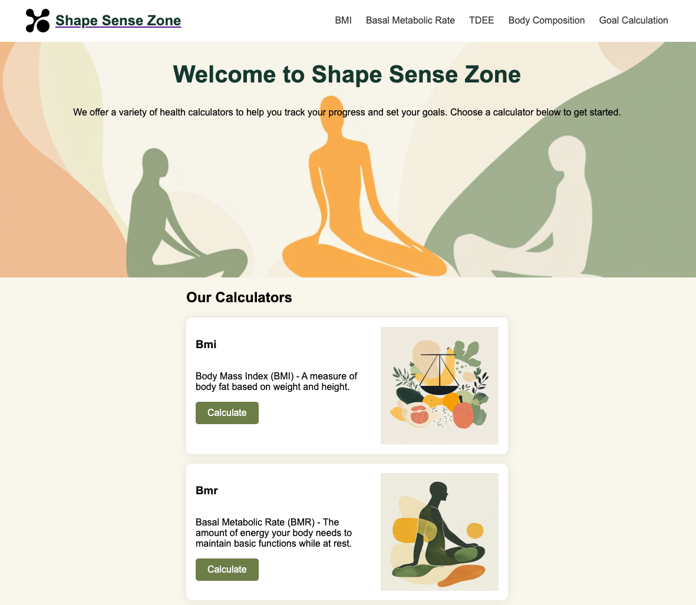

# Shape Sense Zone



A health calculator suite providing accurate measurements and calculations for health tracking and goal setting.

## Live Application

🌐 [shape-sense-zone.netlify.app](https://shape-sense-zone.netlify.app)

## Table of Contents

- [Overview](#overview)
- [Features](#features)
- [Technology Stack](#technology-stack)
- [Getting Started](#getting-started)
- [Development](#development)
- [Contributing](#contributing)
- [Testing](#testing)
- [Deployment](#deployment)
- [Support](#support)
- [License](#license)

## Overview

Shape Sense Zone is a modern, TypeScript-based single-page application designed to provide accurate health and fitness calculations. Built with a focus on user experience and accuracy, it supports various health metrics calculations while maintaining data privacy by using session-based storage.

### Key Principles

- **Accuracy**: Precise calculations based on established medical formulas
- **Privacy**: No data stored beyond the current session
- **Accessibility**: Clear interface with support for different measurement systems

## Features

### Health Calculators

- **BMI Calculator**

  - Body Mass Index calculation
  - Health risk assessment
  - Ideal weight range

- **Body Composition Tools**

  - Body Fat Percentage
  - Waist-to-Hip Ratio
  - Waist-to-Height Ratio
  - Lean Body Mass

- **Metabolic Calculations**

  - Basal Metabolic Rate (BMR)
  - Total Daily Energy Expenditure (TDEE)

- **Goal Planning**
  - Weight Goal Timeline
  - Required Caloric Intake
  - Progress Estimation

### Technical Features

- Responsive design for all device sizes
- Session-based data persistence
- Dynamic unit conversion (Metric/Imperial)
- Real-time calculation updates
- Comprehensive input validation
- Detailed health risk assessments
- Information about the calculators

## Technology Stack

### Core Technologies

- TypeScript 4.9.5
- Vite 4.5.0
- HTML5
- CSS3

### Development Tools

- ESLint 8.52.0
- Prettier 3.3.3
- body-measurements (custom package)

### Build Tools

- Vite Build System
- TypeScript Compiler

## Getting Started

### Prerequisites

```bash
node >= 18.x
npm >= 9.x
```

### Installation

1. Clone the repository

```bash
git clone https://github.com/MarkerAnn/shape_sense.git
cd health-calc-application
```

2. Install dependencies

```bash
npm install
```

3. Start development server

```bash
npm run dev
```

### Environment Setup

No environment variables are required for basic setup.

## Development

### Available Scripts

```bash
# Development
npm run dev          # Start development server
npm run build       # Build for production
npm run preview     # Preview production build

# Code Quality
npm run lint        # Run ESLint
npm run format      # Format code with Prettier
npm run type-check  # Run TypeScript type checking

# Combined Commands
npm run lint:fix    # Fix linting issues
npm run lint:check  # Check linting and formatting
```

### Project Structure

You can read more about the architecture of the application [here](ARCHITECTURE.md)

```
src/
├── ts/
│   ├── adapters/          # External integrations
│   ├── constants/         # Application constants
│   ├── controllers/       # MVC Controllers
│   │   ├── BasalMetabolicRate/
│   │   ├── BmiControllers/
│   │   ├── BodyCompositionControllers/
│   │   └── GoalCalculatorControllers/
│   ├── enums/            # Enumeration types
│   ├── interfaces/       # TypeScript interfaces
│   ├── models/          # Data models
│   ├── services/        # Business logic
│   ├── templates/       # HTML templates
│   ├── types/          # Type definitions
│   ├── utils/          # Utility functions
│   ├── validators/     # Input validation
│   └── views/          # MVC Views
├── style/             # CSS styles
└── index.html        # Main HTML file
```

## Contributing

We welcome contributions! Please see our [Contributing Guidelines](CONTRIBUTE.md) for detailed information about:

- Code style and standards
- Commit message conventions
- Pull request process
- Development workflow
- Testing requirements

### Quick Start for Contributors

1. Fork the repository
2. Create a feature branch
3. Make your changes
4. Run tests and linting
5. Submit a pull request

## Testing

### Current Test Coverage

The project currently focuses on manual testing. Contributions to add automated tests are welcome.
You find the manual testreport [here](testreport.md)

### Testing Goals

- Unit tests for calculations
- Integration tests for form submissions
- Accessibility testing

## Deployment

### Automated Deployment

The application automatically deploys to Netlify:

- Main branch → Production ([shape-sense-zone.netlify.app](https://shape-sense-zone.netlify.app))
- Pull requests → Preview deployments

### Manual Deployment

```bash
npm run build
# Built files will be in dist/
```

## Support

### Getting Help

- Open an issue for bugs
- Discussions for feature requests
- Pull requests welcome

### Common Issues

- Check browser console for errors
- Verify input values are within acceptable ranges
- Confirm unit system selection

Link to [issueboard](https://github.com/MarkerAnn/shape_sense/issues)

## License

This project is licensed under the ISC License - see the [LICENSE](LICENSE) file for details.

## Authors and Acknowledgments

### Main Contributors

- Angelica Marker - Initial work and maintenance

---

Built with ❤️ for health-conscious individuals worldwide.
